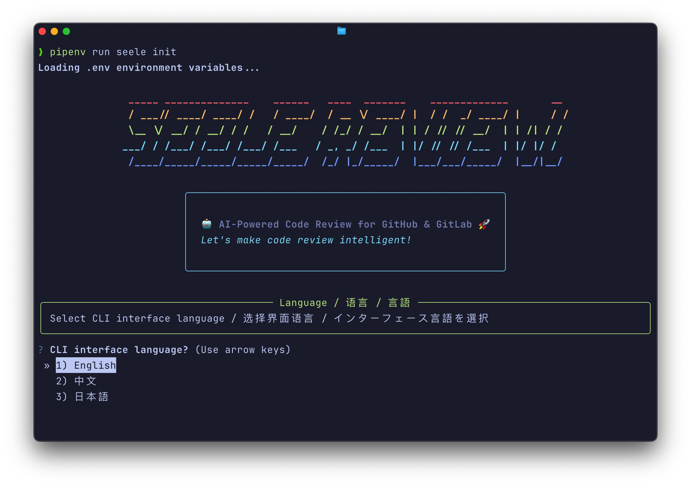

# Seele Review 🤖

<div align="center">

[English](README_EN.md) | 简体中文 | [日本語](README_JA.md)

**AI 驱动的代码审查工具，支持 GitLab 和 GitHub**

[](https://www.python.org/downloads/)
[](https://fastapi.tiangolo.com/)
[](LICENSE)

<br/>

<br/>

[功能特性](#-功能特性) • [快速开始](#-快速开始) • [配置说明](#️-配置说明) • [使用指南](#-使用指南) • [API 文档](#-api-文档)

</div>

---

## 📖 项目简介

Seele Review 是一个智能代码审查助手，使用大语言模型（LLM）自动分析 GitLab Merge Request 和 GitHub Pull Request，提供有建设性的反馈，识别潜在问题，帮助团队保持代码质量。

### 🎯 功能特性

- 🤖 **AI 智能分析** - 支持 GPT-4、Claude 等大语言模型
- 🔄 **多平台支持** - 同时支持 GitLab 和 GitHub
- 📊 **双重审查模式**
  - 💬 **评论模式** - 直接在代码变更处添加行内评论
  - 📄 **报告模式** - 在 MR/PR 描述中生成完整审查报告
- 🌍 **多语言支持** - 支持中文、英文、日文审查评论
- ⚡ **智能分块处理** - 自动将超长 diff 拆分为多个块处理
- 🔔 **通讯软件集成** - 审查完成后实时通知到 Slack、Lark（飞书）
- 🎨 **精美 CLI** - 交互式配置向导，快速上手
- 🔧 **高度可配置** - 通过环境变量灵活配置

---

## 🚀 快速开始

### 环境要求

- Python 3.12+
- Pipenv
- GitLab 或 GitHub 账号及 API 访问权限
- OpenAI API Key 或兼容的 LLM 接口
- （可选）Slack 或 Lark（飞书） Webhook URL

### 安装步骤

1. **克隆仓库**

   ```bash
   git clone git@github.com:onekyuu/seele-review.git
   cd seele-review
   ```

2. **安装依赖**

   ```bash
   pipenv install
   ```

3. **初始化配置**

   ```bash
   pipenv run seele init
   ```

   交互式 CLI 会引导你完成：

   - 选择目标平台（GitLab/GitHub）
   - 设置默认审查语言
   - 配置 API Token
   - 设置 LLM 接口

4. **启动服务**
   ```bash
   pipenv run uvicorn app.main:app --host 0.0.0.0 --port 8000 --reload
   ```

---

## ⚙️ 配置说明

### 环境变量

创建 `.env` 文件或使用 CLI 生成：

```bash
# 平台配置
REPO_TARGETS=gitlab,github              # 支持的平台
REPO_REVIEW_LANG=zh                     # 审查评论语言（zh/en/ja）

# GitLab 配置
GITLAB_BASE_URL=https://gitlab.com
GITLAB_DEFAULT_TOKEN=your_gitlab_token

# GitHub 配置
GITHUB_BASE_URL=https://api.github.com
GITHUB_DEFAULT_TOKEN=your_github_token

# LLM 配置
LLM_BASE_URL=https://api.openai.com/v1
LLM_API_KEY=your_openai_api_key
LLM_MODEL=gpt-4

# 消息推送 配置（可选Slack、Lark）
NOTIFICATION_WEBHOOK_URL=https://hooks.slack.com/services/YOUR/WEBHOOK/URL

# 审查配置
AI_REVIEW_MODE=comment                  # comment 或 report
PUSH_URL=                               # 默认 Slack Webhook（可选）
```

### 手动配置

也可以复制示例配置文件手动编辑：

```bash
cp .env.example .env
nano .env
```

---

## 📚 使用指南

### 配置 Webhook

#### GitLab

1. 进入项目：**设置 > Webhooks**
2. 添加 Webhook URL：`https://your-domain.com/webhook/gitlab`
3. 选择触发器：**Merge request events**
4. 添加自定义请求头（可选）：
   ```
   X-Ai-Mode: comment
   X-Push-Url: https://hooks.slack.com/services/...
   X-Gitlab-Token: your_secret_token
   ```

#### GitHub

1. 进入仓库：**Settings > Webhooks**
2. 添加 Webhook URL：`https://your-domain.com/webhook/github`
3. Content type：`application/json`
4. 选择事件：**Pull requests**
5. 添加 Secret（可选）

### 审查模式

#### 💬 评论模式（默认）

在 MR/PR 的代码变更处直接添加行内评论。

**请求头：**

```http
X-Ai-Mode: comment
```

**示例：**

```diff
@@ -10,3 +10,5 @@
 def login(username, password):
+    return authenticate(username, password)
```

**AI 在第 11 行的评论：**

> ⚠️ **安全风险**  
> 建议在认证前添加输入验证和密码哈希处理。

#### 📄 报告模式

在 MR/PR 描述中生成完整的审查报告摘要。

**请求头：**

```http
X-Ai-Mode: report
```

**示例：**

```markdown
## 🤖 AI 代码审查报告

### 摘要

在 2 个文件中发现 3 个潜在问题。

### 问题列表

| 文件        | 行号 | 严重程度 | 问题         |
| ----------- | ---- | -------- | ------------ |
| app/auth.py | 11   | ⚠️ 警告  | 缺少输入验证 |
| app/db.py   | 45   | 🔴 错误  | SQL 注入风险 |
```

### CLI 命令

```bash
# 初始化配置
pipenv run seele init

# 启动开发服务器
pipenv run seele run --host 0.0.0.0 --port 8000 --reload

# 启动生产服务器（不自动重载）
pipenv run seele run --host 0.0.0.0 --port 8000 --no-reload
```

---

## 🔌 API 文档

### GitLab Webhook

```http
POST /webhook/gitlab
Content-Type: application/json
X-Gitlab-Token: your_token （可选）
X-Ai-Mode: comment （可选，默认：comment）
X-Push-Url: slack_webhook_url （可选）
```

**请求体：** GitLab Merge Request webhook payload

**响应：**

```json
{
  "ok": true,
  "reviews_count": 3,
  "mode": "comment"
}
```

### GitHub Webhook

```http
POST /webhook/github
Content-Type: application/json
X-Hub-Signature-256: signature （可选）
X-Ai-Mode: comment （可选，默认：comment）
```

**请求体：** GitHub Pull Request webhook payload

**响应：**

```json
{
  "ok": true,
  "reviews_count": 5,
  "mode": "comment"
}
```

---

## 🛠️ 开发指南

### 项目结构

```
seele-review/
├── app/
│   ├── config.py              # 配置管理
│   ├── main.py                # FastAPI 应用
│   ├── cli.py                 # CLI 工具
│   ├── routers/               # API 路由
│   │   ├── gitlab.py          # GitLab webhook 处理器
│   │   └── github.py          # GitHub webhook 处理器
│   ├── services/              # 业务逻辑
│   │   ├── agent/             # AI 代理服务
│   │   ├── gitlab.py          # GitLab API 客户端
│   │   ├── github.py          # GitHub API 客户端
│   │   ├── patch/             # Diff 解析
│   │   ├── prompt/            # Prompt 模板
│   │   └── publish/           # 审查发布
│   ├── schemas/               # Pydantic 模型
│   ├── utils/                 # 工具类
│   │   └── token.py           # Token 管理
│   └── prompt/                # Prompt 模板文件
│       ├── prompt-zh.txt      # 中文 prompt
│       ├── prompt-en.txt      # 英文 prompt
│       └── prompt-ja.txt      # 日文 prompt
├── Pipfile                    # Python 依赖
├── README.md                  # 本文档
└── .env                       # 环境变量（需创建）
```

### Token 管理

Seele Review 自动处理超出 LLM 上下文限制的大型 diff：

1. **Token 计数** - 使用 tiktoken 精确计算 token 数量
2. **智能拆分** - 按文件边界拆分以保留上下文
3. **分块处理** - 独立处理每个块
4. **结果合并** - 去重并合并多个块的审查结果

```python
# 使用示例
token_handler = TokenHandler(model="qwen3-max", max_tokens=100000)

# 检查内容是否在限制内
if token_handler.is_within_limit(diff_content):
    reviews = await agent.get_prediction(diff_content)
else:
    # 自动拆分和处理
    reviews = await agent.get_prediction(diff_content)
```

### 添加自定义 Prompt

1. 在 `app/prompt/` 创建新的 prompt 文件：

   ```bash
   touch app/prompt/prompt-fr.txt
   ```

2. 定义 prompt 结构：

   ````text
   你是一个代码审查专家...

   ## new_path: file.py
   ## old_path: file.py
   ...

   输出格式：
   ```yaml
   reviews:
     - newPath: file.py
       oldPath: file.py
       ...
   ````

3. 更新 `PromptService` 加载新 prompt：
   ```python
   def get_messages(self, query: str) -> list:
       lang = settings.repo_review_lang
       prompt_file = f"app/prompt/prompt-{lang}.txt"
       # ...
   ```

### 运行测试

```bash
# 测试 Slack 集成
python app/test_slack.py

# 使用 curl 测试
curl -X POST http://localhost:8000/webhook/gitlab \
  -H "Content-Type: application/json" \
  -H "X-Ai-Mode: comment" \
  -d @test_payload.json
```

---

## 🌟 高级功能

### 自定义审查标准

修改 prompt 以关注特定方面：

- **安全性** - 关注漏洞和安全最佳实践
- **性能** - 识别瓶颈和优化机会
- **代码风格** - 强制执行编码标准
- **文档** - 检查缺失的注释和文档

### 多块处理

处理大型代码变更：

```
[INFO] 查询内容：12000 tokens
[WARNING] 内容超出限制，正在拆分...
[INFO] 拆分为 2 个块
[INFO] 处理块 1/2（6500 tokens）
[INFO] 处理块 2/2（5500 tokens）
[SUCCESS] 从 2 个块合并了 7 条唯一审查
```

### Slack 通知

在 Slack 中接收实时更新：

```
✅ AI 代码审查完成

项目：company/backend-api
MR：修复认证 bug
作者：张三
分支：feature/auth-fix → main
结果：3 条审查评论
```

---

## 🐛 故障排除

### 常见问题

**1. "未生成审查结果"**

- 检查 LLM API Key 和接口地址
- 验证 diff 格式正确
- 检查 token 限制

**2. "未收到 Slack 通知"**

- 验证 webhook URL 正确
- 检查 URL 格式（应包含 `hooks.slack.com`）
- 使用 `app/test_slack.py` 测试

**3. "GitLab/GitHub API 错误"**

- 验证 token 有正确的权限
- 检查 base URL 可访问
- 审查 token 范围（GitLab 需要 api，GitHub 需要 repo）

**4. "Token 限制超出"**

- 增加 TokenHandler 中的 `max_tokens`
- 使用 GPT-4-turbo 或 Claude 获得更大上下文
- 启用自动分块（默认已启用）

### 调试模式

启用详细日志：

```python
# app/main.py
import logging
logging.basicConfig(level=logging.DEBUG)
```

---

## 🤝 贡献

欢迎贡献！请随时提交 Pull Request。

1. Fork 本仓库
2. 创建功能分支（`git checkout -b feature/AmazingFeature`）
3. 提交更改（`git commit -m 'Add some AmazingFeature'`）
4. 推送到分支（`git push origin feature/AmazingFeature`）
5. 打开 Pull Request

---

## 📄 开源协议

本项目采用 MIT 协议 - 详见 [LICENSE](LICENSE) 文件。

---

## 🙏 致谢

- [FastAPI](https://fastapi.tiangolo.com/) - 现代 Web 框架
- [tiktoken](https://github.com/openai/tiktoken) - Token 计数
- [Typer](https://typer.tiangolo.com/) - CLI 框架
- [Rich](https://rich.readthedocs.io/) - 终端格式化

---

<div align="center">

**用 ❤️ 构建于 Seele 团队**

[⬆ 回到顶部](#seele-review-)

</div>
